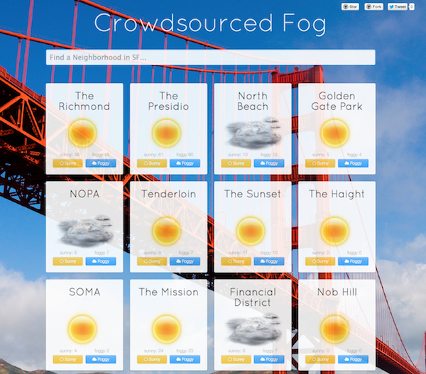

# Crowdsourced Fog

###[See a live demo here](http://firebase.github.io/crowdsourced-fog/)###

This app uses crowdsourced weather input to keep track of whether it's sunny or foggy in different neighborhoods in San Francisco. It's built with [AngularFire](http://angularfire.com/), the official [Firebase](https://www.firebase.com/) bindings for [AngularJS](http://angularjs.org/). Crowdsourced Fog makes use of AngularFire's three-way data binding by automatically synchronizing changes between the Angular model, the view, and the data in Firebase.

## License

[MIT](http://firebase.mit-license.org/)