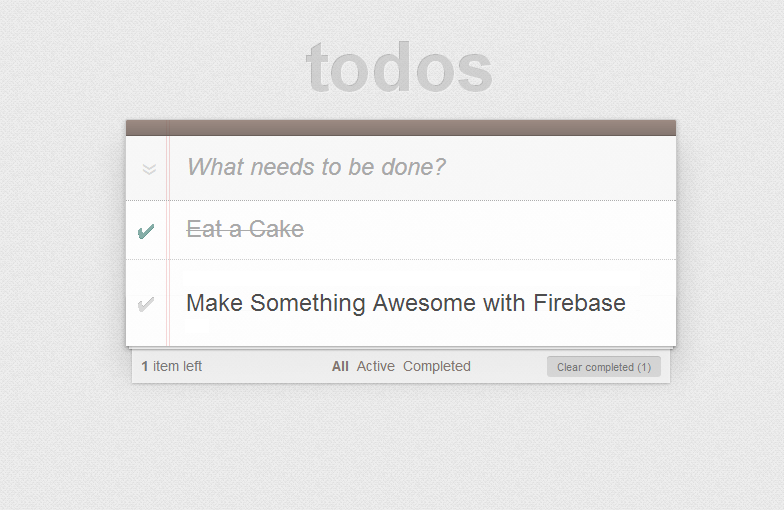

# Firebase & AngularJS TodoMVC Example

Firebase provides a realtime persistence layer for JSON data. In this example,
we combine Firebase with AngularJS to create a collaborative TODO app where
the TODO items are persisted and updated in realtime.

There is very little difference between this app and the vanilla AngularJS
TODO app in how AngularJS is used. The only significant difference is the
use of [AngularFire](http://github.com/firebase/angularFire), which provides
an AngularJS service for persisting and updating TODO items in realtime.

## License

[MIT](http://firebase.mit-license.org/)